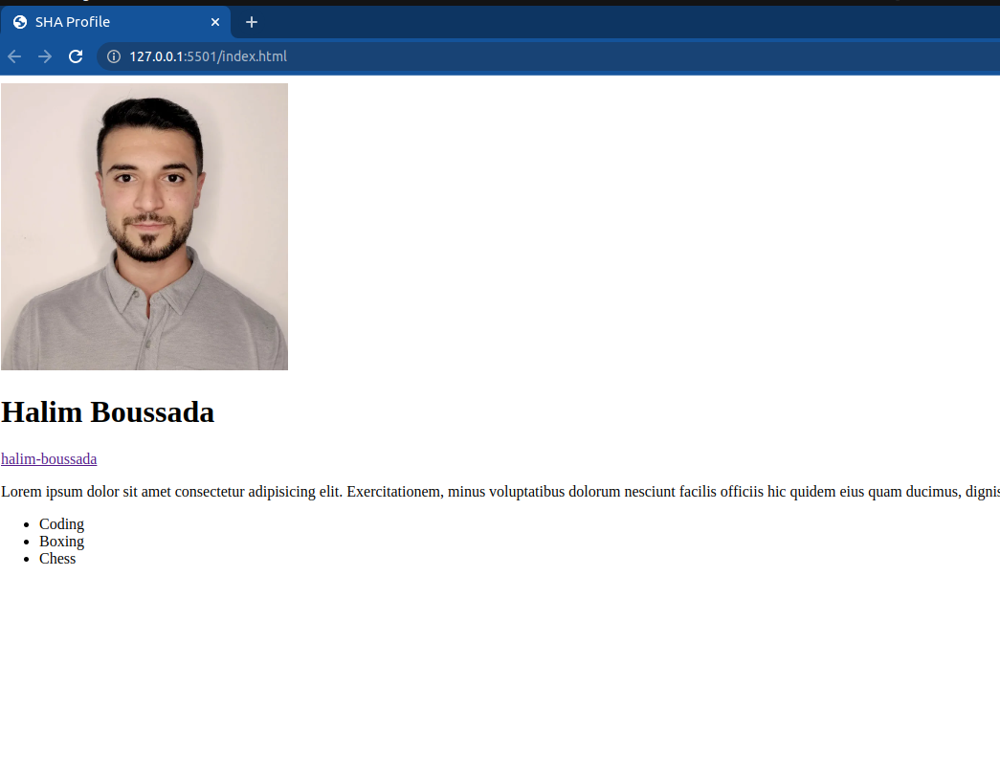

## CSS-Basics / Styling your Profile Page

### Instructions:

- For this assignment, you'll be using CSS to style the profile page that you created in the previous task.

  

- Your goal is to choose one of the provided designs and replicate it using CSS.

- ### Style1

 

---

- ### Style2

 

---

- ### Style3

 

---

- ### Style4

---

- Try to practice the following while you are working:

  - inline styles
  - internal style tags `style`
  - external styles, `link`
  - use of classes || IDs
  - use of `text-align` CSS rule
  - use of `color` and `background-color` CSS rules
  - use of `font-family` and `font-size` CSS rules
  - use of `border` CSS rule
  - Apply colors for both the text content and the background color of the elements.

- You are free to use any other CSS rule you like to create your own style!

- Upload your project to netlify and submit the link in Athena platform along with the pull request you created in GitHub.

  <h1 style="text-align:center">Be creative!&#128526 </h1>
